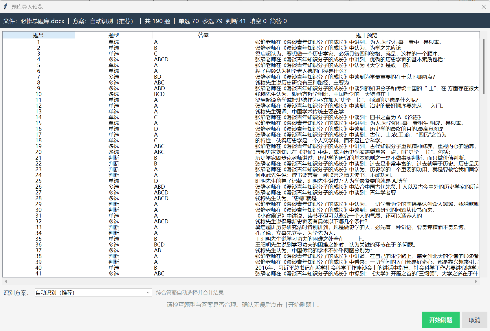
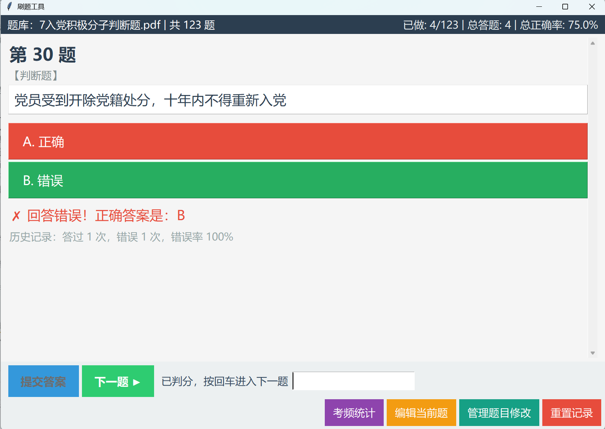
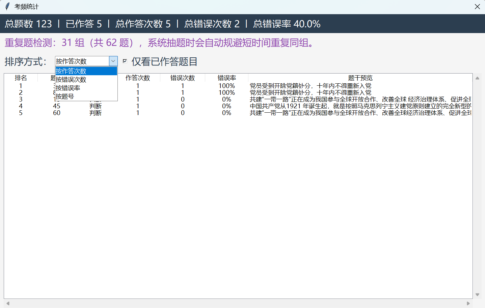
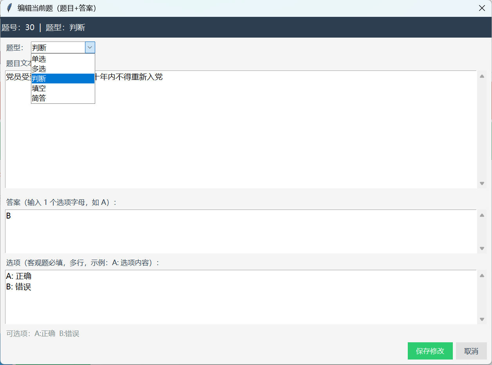

# SuperReciteHelper

一个面向日常复习和考试准备的桌面刷题工具。支持**多种文件格式**导入、**自动识别**题型与答案，并根据你的作答情况进行加权抽题，优先复习薄弱点。

当前版本：3.2.3（2026-04-12）

## 项目定位

SuperReciteHelper 的目标是把分散在不同文档里的题目自动提取出来，并生成可持续重复刷题的题库，提升复习效率。同时能够统计错误率，让用户清楚的知道自己在哪些题目上更薄弱，针对性地进行复习。

适用场景：
- 背诵型课程（如各类政治课）期末复习
- 职业考试题库训练
- 记忆型知识点高频回顾

## 核心功能

- 多格式导入：支持 txt、pdf、doc、docx。
- 多文件合并：可跨目录多次追加文件并合并成一个题库。
- 解析预览：导入后可在预览界面切换识别方案，确认后再开始刷题。
- 多题型支持：单选、多选、判断、填空、简答。
- 多样答案标记识别：支持答案行、红色字体、下划线、加粗、背景色等样式线索。
- 手动修题：支持在预览阶段或刷题阶段修改题目与答案，修改可持久保存。
- 错题加权抽题：基于历史作答次数与错误次数动态提高薄弱题出现概率。
- 考频统计：按作答次数、错误次数、错误率等维度查看题目统计。
- 键盘快捷作答：客观题可直接输入 A/B/C 等字母并回车提交。主观题可在看答案后输入 t/f 自评对错。

## 运行方式

### 方式一：直接运行打包版（推荐普通用户）

仓库中的 quiz_app.exe 为可执行版本，双击即可使用（Windows）。

### 方式二：运行 Python 源码（推荐开发者）

1. 准备 Python 环境。作者开发时使用3.12版本，但应该支持绝大部分版本。
2. 安装依赖：

```bash
pip install python-docx pypdf pymupdf pywin32
```

- python-docx：解析 docx。
- pypdf / pymupdf：解析 pdf（程序优先使用 pymupdf）。
- pywin32：通过 Word COM 读取 doc（仅 Windows，且本机需安装 Microsoft Word）。

3. 运行程序。

## 使用流程

1. 启动程序后选择题库文件（支持多次增加文件）。
2. 在导入预览页检查题型和答案，可切换识别方案或手动修改题目。
3. 点击“开始刷题”进入练习。
4. 作答后查看结果，系统自动记录历史并调整后续抽题权重。
5. 可随时查看统计数据，了解自己的薄弱点。

## 题库格式建议

为获得更稳定的识别效果，建议：

- 使用清晰题号（如 1. / 1、）。
- 客观题选项使用 A. B. C. D. 等规范前缀。
- 答案行尽量使用“答案：”或“参考答案：”标识。
- 填空题尽量保留明显挖空符号（如下划线、（ ）等）。
- 如果文档使用颜色或样式标注答案，尽量统一标注方式。
- 如果您的文件无法被程序识别，建议将文件发送给任意ai，要求其按照“数字编号+题干+正确答案”的方式整理为txt或docx格式后再导入。尽管本程序尽量增加了识别方式，但仍然有一些格式不同的文件无法被正确解析，此时使用ai整理题库无疑是良好的选择！

## 数据存储

程序会在系统用户目录下保存状态与记录（Windows 通常位于 `%APPDATA%/SuperReciteHelper/`）：

- error_record.json：作答历史与错误记录。
- app_state.json：最近打开文件等应用状态。
- question_edits.json：手动修改过的题目与答案。

这意味着：
- 关闭程序后，下次仍可继续使用历史统计。
- 手动修题结果会在后续导入中自动应用。

## 实际效果








## 开发过程
第一份代码由本人和ChatGPT共同编写，当时只针对一种格式进行规划，目的是辅助本人背诵。
后续代码由GPT-5.3-Codex在本人指导下修改。

鸣谢：Github学生认证，它让我可以方便的使用GPT-5.3-Codex进行开发。

## 未来计划
- 增加更多文件格式的支持，如Markdown等。
- 优化用户界面和交互体验。


## 修改记录
当前版本：3.2.3（2026-04-12）
- 3.2.3：支持了表格式的参考答案（来源为程设期中试题）
- 3.2.2：考频统计界面允许点击打开详细题目。
- 3.2.1：允许手动修改题目，防止题目识别错误影响使用体验。
- 3.2.0：增加了保存功能，用户可以直接选择上次的题库。同时修改了错题记录逻辑，使用hash保证错题记录正确。
- 3.1.3：增加多文件同时导入功能，并修正了部分文件解析错误。
- 3.1.2：修正了选项解析逻辑，避免选项间格式干扰。
- 3.1.1：修复了无法识别出正确格式导致整份文件只能读出少量题目的bug
- 3.1.0：优化了UI，实现了高分辨率
- 3.0.x：正式开始开发此通用版本，增加了更多题型、文件格式、答案标记方式的支持。
- 2.x：支持了选择和判断题，但仍只支持txt文件。
- 1.x：初始版本，仅支持txt文件和简答题。