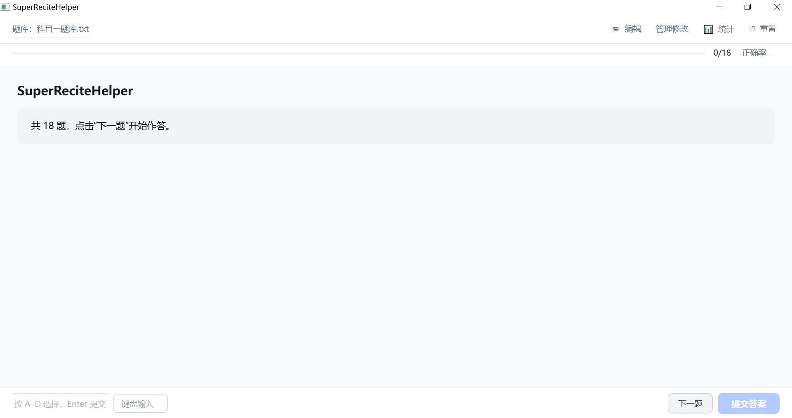
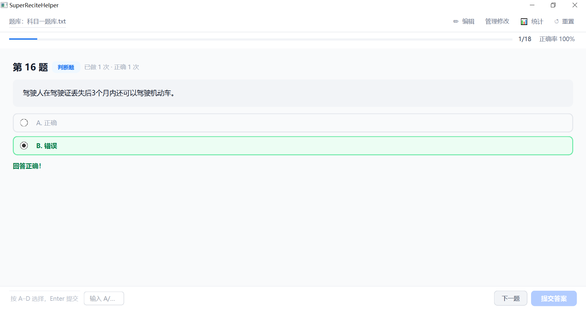
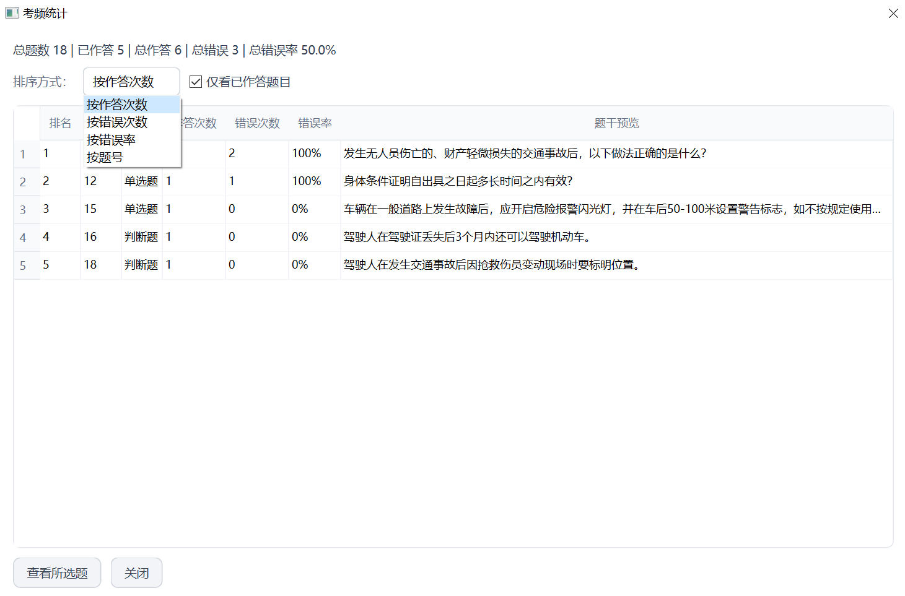
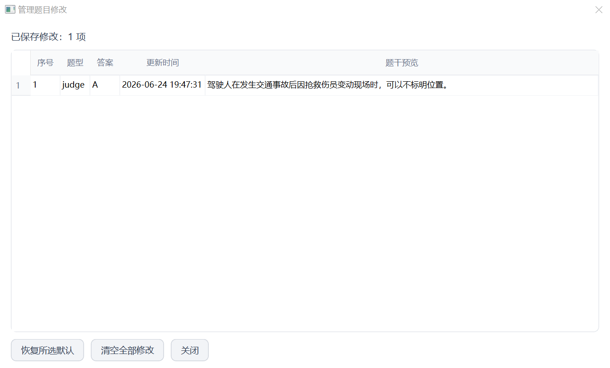

# SuperReciteHelper

一个面向日常复习和考试准备的桌面刷题工具。支持**txt, doc, docx文件格式**导入、**自动识别**题型与答案，并根据你的作答情况进行加权抽题，优先复习薄弱点。

当前版本：5.2（2026-06-24）

录频演示北大网盘链接：https://disk.pku.edu.cn/link/AA83B5FBCDF6C44B9986BE016910421EB3

文件名：16组-SuperReciteHelper-录屏演示.mp4

有效期限：2026-07-31 16:54

## 0. 项目定位

`SuperReciteHelper` 的目标是把分散在不同文档里的题目自动提取出来，并生成可持续重复刷题的题库，提升复习效率。同时能够统计错误率、根据作答正确率动态调整题目抽取概率，让用户清楚的知道自己在哪些题目上更薄弱，针对性地进行复习。将题库识别整合、刷题练习、错题统计等功能整合到同一个桌面应用中。

适用场景：
- 背诵型课程（如各类政治课）期末复习
- 职业考试题库训练
- 记忆型知识点高频回顾

## 1. 功能介绍

### 1.1 核心功能

- 多格式导入与识别：支持 txt, doc, docx，当前实现方案基于正则匹配，后续考虑升级为大模型 API
- 多文件合并：可跨目录多次追加文件并合并为一个题库
- 多题型支持：单选、多选、判断、填空、简答，用户可点击选项或键盘输入选项，提交后客观题自动判断正误、主观题由用户自已衡量
- 键盘快捷作答：客观题可直接输入 A/B/C 等字母并回车提交。主观题可在看答案后输入 t/f 自评对错
- 多样答案标记识别：支持答案行、红色字体、下划线、加粗、背景色等样式线索
- 手动修题：支持在预览阶段或刷题阶段修改题目与答案，修改可永久保存
- 错题加权抽题：基于历史作答次数与错误次数动态提高薄弱题出现概率
- 考频统计：按作答次数、错误次数、错误率等维度查看题目统计

### 1.2 使用流程

1. 启动程序后选择题库文件（支持多次增加文件）。
  （题库解析需要时间！有数秒无响应是正常现象！）
2. 点击“开始刷题”按钮进入练习。
3. 作答后查看结果，系统自动记录历史并调整后续抽题权重。
4. 可随时查看统计数据，了解自己的薄弱点。

#### 1.2.1 客观题作答流程

```
下一题 → 显示题目与选项 → 用户选择选项 → 提交答案
  │                                         │
  │                                         ├─ 自动判分
  │                                         ├─ 高亮正确/错误选项
  │                                         └─ 更新记录
  │
  └─ 下一题（回车或点击按钮）
```

#### 1.2.2 主观题作答流程

```
下一题 → 显示题目 → 用户自行作答 → 显示正确答案
  │                                      │
  │                                      └─ 用户自评（答对/答错）
  │                                              │
  │                                              └─ 更新记录
  └─ 下一题
```

### 1.3 题库格式建议

为获得更稳定的识别效果，建议：

- **尽量少使用Word特殊格式！**（如编号、列表、颜色）。如果识别失败，可以先尝试将全文按纯文本格式保存（这可以通过全选-剪切-黏贴（仅文本）来实现）。
- 使用清晰题号（如 1. / 1、）。
- 客观题选项使用 A. B. C. D. 等规范前缀。
- 答案行尽量使用“答案：”或“参考答案：”标识。
- 填空题尽量保留明显挖空符号（如下划线、（ ）等）。
- 如果您的文件无法被程序识别，建议将文件**发送给任意ai**，要求其按照“数字编号+题干+正确答案”的方式整理为txt或docx格式后再导入。尽管本程序尽量增加了识别方式，但仍然有一些格式不同的文件无法被正确解析，此时**使用ai整理题库无疑是良好的选择**！（我们正在考虑是否要外接api处理文档，敬请期待！）

## 2. 运行方式

### 方式一：直接运行打包版（推荐普通用户）

仓库中的 SuperReciteHelper_v5.2.exe 为可执行版本，双击即可使用（Windows）。

关于Mac和Android等版本，请期待后续开发~

### 方式二：运行 Python 源码（推荐开发者）

1. 准备 Python 3.10+ 环境，未测试更低版本环境，不确定是否兼容
2. 安装依赖

```bash
pip install PyQt6 python-docx pywin32
```

- PyQt6: 图形界面必要依赖
- python-docx：解析 docx。
- pywin32：通过 Word COM 读取 doc（仅 Windows，且本机需安装 Microsoft Word）。

3. 运行程序 `python main.py`

## 3. 实现思路

### 3.1 文档解析

目前项目使用的是基于正则匹配的解析思路 (`parser.py`)，对源文档的格式有一定要求，参考格式建议见 1.3 节。
后续将把解析工具完全迁移至基于 DeepSeek API 的实现思路 (`llm_parser.py`)，解析以语义为主，对格式的要求将大幅降低。

### 3.2 题库构建及抽题策略

- `question.py`: 将解析得到的字符串转换为前端所需的题目数据格式，并支持手动修改题目信息
- `question_bank.py`: 存储题目作答记录、手动编辑等信息
- `session.py`: 加权随机抽题算法，优先抽取错误次数多、错误率高的题目

#### 3.2.1 数据存储

本程序会在系统用户目录下保存状态与记录（Windows 通常位于 `%APPDATA%/SuperReciteHelper/`），支持历史统计、手动修改的保存和复用。
共生成如下三个文件：
- `error_record.json`：作答历史与错误记录。
- `app_state.json`：最近打开文件等应用状态。
- `question_edits.json`：手动修改过的题目与答案。

### 3.3 图形界面
- `ui_main.py`: 连接前端与后端 `QuizApp`，控制刷题主界面、题库状态与交互变量
- `ui_pyqt.py`: 图形界面模块 `QuizWindow`，负责主界面布局、显示题目及下一题、提交答案、调用各类弹窗、键盘输入等功能
- `ui_pyqt_dialogs.py`: 定义各类 PyQt 弹窗（题目编辑、管理修改、考频统计和题目详情）及界面共用常量


## 4 运行效果图展示








## 5 开发过程及后续展望

### 5.1 开发记录
第一份代码由 @RavenX2007 和 ChatGPT 共同编写，当时只针对一种格式进行规划，目的是辅助本人背诵。
后续该项目拓展成为本小组程设大作业，代码框架由 @RavenX2007 完成，UI部分的升级由 @jih484287-wq 完成，后续的维护和拓展由 @GeorgeZhou 完成。

当前版本：5.2（2026-06-24）
- 5.2: 由 @GeorgeZhou 主导，将项目代码重新组织，以便于后续维护和开发，并拓展 LLM 解析器接口
- 5.1：由 @RavenX2007 进行了一些修复和优化
- 5.0.x：由 @jih484287-wq 主导开发，重构了UI，由tk改为PyQt。
- 4.1.x：修复了抽题逻辑，根据作答情况动态大幅加权新题抽取概率。
- 4.0.0：将原来的单文件拆分为多文件，便于后续开发和维护。
- 3.2.4：修复了读取题型混杂的大文件时，不能识别出其中的简答题的bug。（来源为作者整理的汉英翻译题库）
- 3.2.3：支持了表格式的参考答案（来源为程设期中试题）
- 3.2.2：考频统计界面允许点击打开详细题目。
- 3.2.1：允许手动修改题目，防止题目识别错误影响使用体验。
- 3.2.0：增加了保存功能，用户可以直接选择上次的题库。同时修改了错题记录逻辑，使用hash保证错题记录正确。
- 3.1.3：增加多文件同时导入功能，并修正了部分文件解析错误。
- 3.1.2：修正了选项解析逻辑，避免选项间格式干扰。
- 3.1.1：修复了无法识别出正确格式导致整份文件只能读出少量题目的bug
- 3.1.0：优化了UI，实现了高分辨率
- 3.0.x：正式开始开发此通用版本，增加了更多题型、文件格式、答案标记方式的支持。
- 2.x：支持了选择和判断题，但仍只支持txt文件。
- 1.x：初始版本，仅支持txt文件和简答题。

## 5.2 未来计划
1. 增加更多文件格式的支持，如Markdown等
  - 扩展支持大概率需要从正则匹配切换至 api 格式化解析，目前已加入基于 DeepSeek API 的解析接口
2. 优化用户界面和交互体验
3. 解耦前端和后端，将导入的题库文件首先解析至 json 文件，再统一从 json 文件接入 ui 界面
